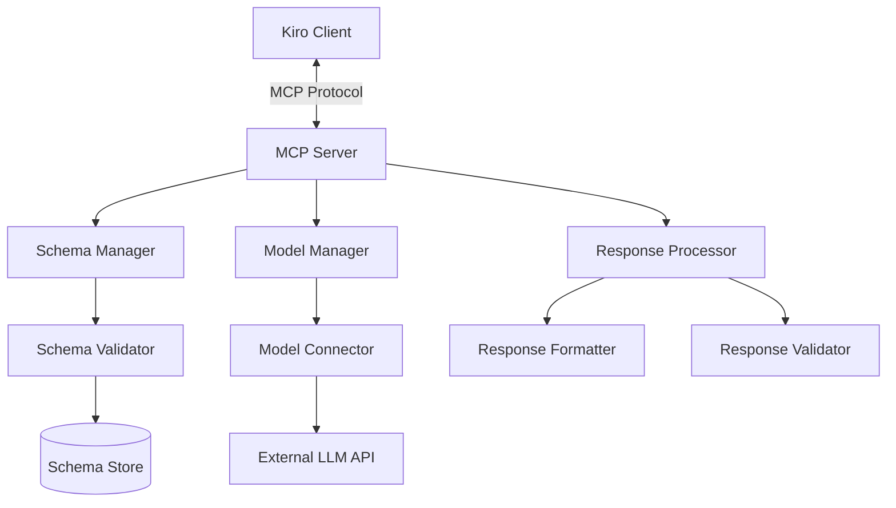

# Design Document: Fixed Schema Response MCP Server

## Overview

The Fixed Schema Response MCP Server is designed to process user queries and return responses in a predefined structured format (e.g., JSON). This design document outlines the architecture, components, interfaces, data models, error handling, and testing strategy for implementing this MCP server.

The server will leverage the Model Context Protocol (MCP) to communicate with Kiro and will use language models to generate responses that conform to specified schemas. The primary goal is to ensure that all responses follow a consistent structure, making them predictable and easily consumable by applications.

## Architecture

The Fixed Schema Response MCP Server follows a modular architecture with clear separation of concerns:



### Key Components:

1. **MCP Server Core**: Handles the MCP protocol communication with Kiro, manages request/response lifecycle, and orchestrates the other components.

2. **Schema Manager**: Loads, parses, and manages schema definitions. Provides schema validation capabilities.

3. **Model Manager**: Manages connections to language models, handles model configuration, and processes model requests/responses.

4. **Response Processor**: Processes raw model outputs, formats them according to schemas, and validates the final responses.

## Components and Interfaces

### 1. MCP Server Core

```python
class MCPServer:
    def __init__(self, config_path: str):
        # Initialize server with configuration
        pass
        
    async def start(self):
        # Start the server and listen for connections
        pass
        
    async def stop(self):
        # Stop the server gracefully
        pass
        
    async def handle_request(self, request: dict) -> dict:
        # Process incoming requests and return responses
        pass
```

### 2. Schema Manager

```python
class SchemaManager:
    def __init__(self, schema_path: str):
        # Load schemas from the specified path
        pass
        
    def get_schema(self, schema_name: str) -> dict:
        # Get a schema by name
        pass
        
    def validate_against_schema(self, data: dict, schema_name: str) -> bool:
        # Validate data against a schema
        pass
        
    def reload_schemas(self):
        # Reload schemas from disk
        pass
```

### 3. Model Manager

```python
class ModelManager:
    def __init__(self, config: dict):
        # Initialize with model configuration
        pass
        
    async def generate_response(self, prompt: str, parameters: dict) -> str:
        # Generate a response from the model
        pass
        
    def set_model_parameters(self, parameters: dict):
        # Update model parameters
        pass
```

### 4. Response Processor

```python
class ResponseProcessor:
    def __init__(self, schema_manager: SchemaManager):
        # Initialize with schema manager
        pass
        
    async def process_response(self, raw_response: str, schema_name: str) -> dict:
        # Process and format the raw response according to the schema
        pass
        
    def validate_response(self, processed_response: dict, schema_name: str) -> bool:
        # Validate the processed response against the schema
        pass
        
    def fix_response(self, response: dict, schema_name: str) -> dict:
        # Attempt to fix a response that doesn't conform to the schema
        pass
```

## Data Models

### 1. Configuration

```json
{
  "server": {
    "host": "localhost",
    "port": 8000,
    "log_level": "info"
  },
  "model": {
    "provider": "openai",
    "model_name": "gpt-4",
    "api_key": "YOUR_API_KEY",
    "parameters": {
      "temperature": 0.7,
      "top_p": 1.0,
      "max_tokens": 1000
    }
  },
  "schemas": {
    "path": "./schemas",
    "default_schema": "default"
  }
}
```

### 2. Schema Definition

```json
{
  "name": "product_info",
  "description": "Schema for product information responses",
  "schema": {
    "type": "object",
    "required": ["name", "description", "price", "category"],
    "properties": {
      "name": {
        "type": "string",
        "description": "The name of the product"
      },
      "description": {
        "type": "string",
        "description": "A detailed description of the product"
      },
      "price": {
        "type": "number",
        "description": "The price of the product in USD"
      },
      "category": {
        "type": "string",
        "description": "The category the product belongs to"
      },
      "features": {
        "type": "array",
        "items": {
          "type": "string"
        },
        "description": "List of product features"
      }
    }
  },
  "system_prompt": "You are a product information assistant. Provide information about products in a structured format."
}
```

### 3. Request/Response Format

**Request:**
```json
{
  "query": "Tell me about the latest iPhone",
  "schema": "product_info",
  "parameters": {
    "temperature": 0.5
  }
}
```

**Response:**
```json
{
  "status": "success",
  "data": {
    "name": "iPhone 15 Pro",
    "description": "The latest flagship smartphone from Apple featuring...",
    "price": 999.99,
    "category": "Smartphones",
    "features": [
      "A17 Pro chip",
      "48MP camera system",
      "Titanium design",
      "Action button"
    ]
  },
  "metadata": {
    "model": "gpt-4",
    "processing_time": 1.25
  }
}
```

**Error Response:**
```json
{
  "status": "error",
  "error": {
    "code": "schema_validation_failed",
    "message": "Generated response failed schema validation",
    "details": {
      "missing_fields": ["price"]
    }
  },
  "metadata": {
    "model": "gpt-4",
    "processing_time": 0.75
  }
}
```

## Error Handling

The MCP server implements a comprehensive error handling strategy:

1. **Input Validation Errors**: Errors related to invalid input parameters or schemas.
   - Schema not found
   - Invalid request format
   - Missing required parameters

2. **Model Errors**: Errors related to model generation.
   - Connection failures
   - API rate limits
   - Invalid model responses

3. **Schema Validation Errors**: Errors related to response validation against schemas.
   - Missing required fields
   - Invalid data types
   - Constraint violations

4. **Server Errors**: Internal server errors.
   - Configuration errors
   - Resource allocation failures
   - Unexpected exceptions

Each error type has a specific error code, message format, and handling strategy. The server will attempt to recover from transient errors and provide detailed error information to clients.

## Testing Strategy

The testing strategy for the Fixed Schema Response MCP Server includes:

1. **Unit Tests**:
   - Test individual components in isolation
   - Mock dependencies for controlled testing
   - Cover all public methods and error cases

2. **Integration Tests**:
   - Test interactions between components
   - Verify schema validation logic
   - Test model integration with mock responses

3. **End-to-End Tests**:
   - Test the complete request/response flow
   - Verify correct handling of various query types
   - Test performance under load

4. **Schema Validation Tests**:
   - Test validation against various schema types
   - Test handling of edge cases and invalid schemas
   - Verify schema reloading functionality

5. **Error Handling Tests**:
   - Test recovery from various error conditions
   - Verify correct error response formats
   - Test retry mechanisms

The testing framework will use pytest for Python implementation, with appropriate mocking libraries to simulate external dependencies like language model APIs.